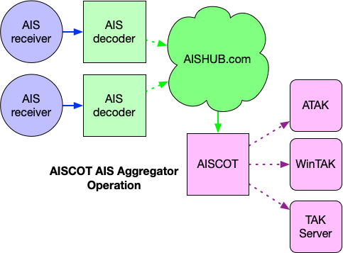

# Concept of Operations

AISCOT can operate in two different modes, as described in detail below:

1. AIS Over-the-air (RF)
2. AIS Aggregator (AISHUB)

## AIS Over-the-air Operation (RF)

Receive AIS data from a VHF AIS receiver, such as the 
Megwatt [dAISy+](https://shop.wegmatt.com/products/daisy-ais-receiver). From there 
AIS can be decoded by [AIS Dispatcher](https://www.aishub.net/ais-dispatcher) or [AIS-catcher](https://github.com/jvde-github/AIS-catcher) and 
forwarded to AISCOT to be transformed to CoT and transmitted to TAK.

## AIS Aggregator Operation (AISHUB.com)

   
Receive AIS data from the [AISHUB](https://www.aishub.com>) service. 
Requires a subscription to AISHUB.
