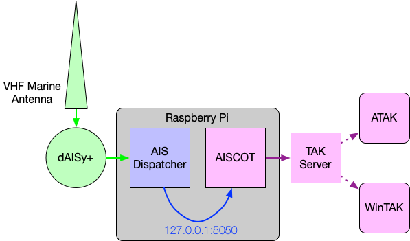

The following diagram shows an example setup of AISCOT utilizing a dAISy+ AIS receiver 
with an outboard Marine VHF antenna, a Raspberry Pi running aisdispatcher and AISCOT, 
forwarding COT to a TAK Server and WinTAK & ATAK clients. (OV-1)





## Run on a Raspberry Pi

This example configuration can run along-side the dump1090 software on the same computer, or on computers connected over an IP network (i.e. A remote Raspberry Pi running dump1090). 

ADS-B data is transformed into TAK data and forwarded to our TAK Server over TCP port ``8087``.

```ini
[adsbcot]
COT_URL = tcp://takserver.example.com:8087
FEED_URL = tcp://sensor.example.com:30003
```

### Usage

1. Add the configuration text to a configuration file named: ``adsbcot.ini``
2. Use the configuration file when starting ADSBCOT: ``adsbcot -c adsbcot.ini``
> Ensure you know the full path to your configuration file.

## Forward to ATAK

This example configuration can run along-side the dump1090 software on the same computer, or on computers connected over an IP network (i.e. A remote Raspberry Pi running dump1090). 

ADS-B data is transformed into TAK data and forwarded to our ATAK Mesh SA Multicast Network.

```ini
[adsbcot]
COT_URL = udp+wo://239.2.3.1:6969
FEED_URL = tcp://10.1.2.24:30003
```

### Usage

1. Add the configuration text to a configuration file named: ``adsbcot.ini``
2. Use the configuration file when starting ADSBCOT: ``adsbcot -c adsbcot.ini``
> Ensure you know the full path to your configuration file.

## Use aircraft JSON API

This example configuration can run along-side the dump1090 software on the same computer, or on computers connected over an IP network (i.e. A remote Raspberry Pi running dump1090). 

ADS-B data is read from the dump1090 aircraft JSON API URL every 10 seconds, and is transformed into TAK data. From there it is forwarded to our TAK Server over TLS port ``8089`` using client certificates.

```ini
[adsbcot]
PYTAK_TLS_CLIENT_CERT = /etc/my_client_cert.pem
COT_URL = tls://takserver.example.com:8089
FEED_URL = http://piaware.local:8080/data/aircraft.json
POLL_INTERVAL = 10
```

### Usage

1. Add the configuration text to a configuration file named: ``adsbcot.ini``
2. Use the configuration file when starting ADSBCOT: ``adsbcot -c adsbcot.ini``
> Ensure you know the full path to your configuration file.

## Using AISStream.io for maritime data

This example shows how to use the AISStream.io web API to get real-time maritime data for the Gulf of Mexico region and forward it to a TAK Server.

```ini
[aiscot]
# Connect to TAK Server over TCP
COT_URL = tcp://10.10.10.233:8086

# AISstream.io API key (get one at aisstream.io)
AISSTREAM_API_KEY = your_api_key_here

# Gulf of Mexico coordinates 
# IMPORTANT: AISStream.io uses [latitude, longitude] format
BBOX_LAT_MIN = 18
BBOX_LON_MIN = -98
BBOX_LAT_MAX = 30
BBOX_LON_MAX = -82

# Message types to include (multiple types for better coverage)
AISSTREAM_MESSAGE_TYPES = PositionReport,ShipStaticData,StandardClassBPositionReport,ExtendedClassBPositionReport

# Optional file path for persisting vessel names
# VESSEL_CACHE_FILE = vessel_names.json
```

### Usage

1. Add the configuration text to a configuration file named: `aiscot.ini`
2. Use the configuration file when starting AISCOT: `aiscot -c aiscot.ini`

### Notes on AISStream.io

- You must [register on the AISStream.io website](https://aisstream.io/) to get an API key.
- Unlike other data sources, when using AISStream.io, you should **not** set the `FEED_URL` parameter.
- The coordinate format is critical - AISStream.io uses [latitude, longitude] which is opposite of many mapping systems.
- If you're not seeing any data, check that:
  1. Your API key is correct
  2. Your bounding box coordinates are in the correct format
  3. Your bounding box covers an area with active maritime traffic
  4. You're requesting the right message types

## Using environment variables

```bash linenums="1"
export COT_URL="udp://10.9.8.7:8087"
export FEED_URL="tcp+raw://127.0.0.1:30002"
adsbcot
```
